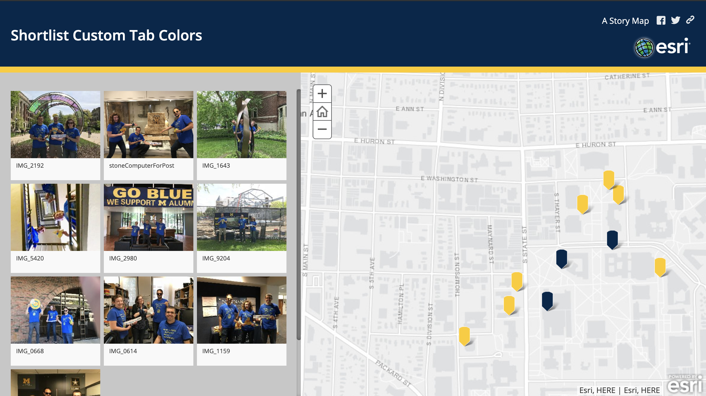

Story Map Shortlist: Custom Marker Colors
================
This is an update to Esri's story map shortlist that allows for specifying the color of each location marker.

 

The Story Map Shortlist app lets you organize points of interest into tabs that make it fun for users to explore what's in an area. Your users can click on the places either in the tabs or on the map to find out about them. The tabs automatically update as users navigate around the map to show them what's interesting in their current map extent.

## How to use this code
In order to make this customization, you will need to update the shortlist source code, 
which means hosting the finished app on your own site. Some useful articles on this topic 
are listed here:
* [Introduction to Hosting Your Own Story Map](https://medium.com/story-maps-developers-corner/an-introduction-to-hosting-your-own-story-map-e2450181ad2f)
* [Setting Up Your Story Maps Development Environment](https://medium.com/story-maps-developers-corner/setup-your-story-maps-development-environment-783522f3e0f)

### Before You Begin
Development of your shortlist story map should be done using the 
[classic shortlist builder](https://storymaps-classic.arcgis.com/en/). Once you have your story map 
configured how you want it (other than the custom markers), find its [item ID in ArcGIS Online](https://community.esri.com/community/gis/web-gis/arcgisonline/blog/2019/06/06/where-can-i-find-the-item-id-for-an-arcgis-online-item),
 then proceed with the customization steps below.

### Customization Steps
There are four main steps in using this customization: downloading the code and pointing it 
at your shortlist app, adding a color_id field to your web map, updating the color_id field for
each feature, and building and publishing your app. The first three steps are described here; the 
fourth is covered in the links provided above.
1. Download the code and point it at your app. [Clone or download](https://help.github.com/en/github/creating-cloning-and-archiving-repositories/cloning-a-repository)
this repository, then follow the steps in the [Setting Up Your Story Maps Development Environment](https://medium.com/story-maps-developers-corner/setup-your-story-maps-development-environment-783522f3e0f)
article to make sure you have all the necessary support packages installed. To point the customized app at your 
story map content, open the [storymap-shortlist-custom-marker-colors/src/index.html](src/index.html) file and find line 40. 
It should look like this: 
    ```
    // Enter an application ID created through the Shortlist builder
    appid: "181c71e9ecf8465da7567b8878a82af1",
    ```
    Replace the appid (in quotes) with your story map's item ID.
    
2. Add a color_id field to the web map's feature collection. This requires editing the item's JSON; I find [AGOL Assistant](https://ago-assistant.esri.com/)
to be the easiest way to do this. *Note that this step will be changing the underlying saved representation of your story
map; it is highly recommended that you copy or back up your story map before continuing.* Once you've logged in to AGOL Assistant, from the "I want to..." menu at the top of the screen,
select "View an Item's JSON", then use the item listing on the left side of the screen to navigate to the **Web Map** associated
with your story list. It will likely have a name similar to your story list's name.  

    There are two sections of JSON shown; the first is the web map's description, and the second is its data. Scroll down to 
    the second section and click the Edit (pencil) button. Near the bottom there should be a section called "fields" that looks
    similar to the following:
    ```
                                "fields": [
                                    {
                                        "name": "__OBJECTID",
                                        "alias": "__OBJECTID",
                                        "type": "esriFieldTypeOID",
                                        "editable": false,
                                        "domain": null
                                    },
                                    {
                                        "name": "name",
                                        "alias": "Name",
                                        "type": "esriFieldTypeString",
                                        "editable": true,
                                        "domain": null
                                    },
                                    ...
    
   ```
   To add the color_id field, after one of the ```},``` lines insert the following field:
   ```
                                   {
                                       "name": "color_id",
                                       "alias": "Color Index",
                                       "type": "esriFieldTypeString",
                                       "editable": true,
                                       "domain": null
                                   },
   ```
   (Note that if this is the last item in the list, you should leave off the final comma.)
   Scroll back up to the top of this JSON section and click the Save button. Note that if you have made an error in 
   your typing, this button wil be red. **If this is the case, do not click Save until you have determined what the error is.**

3. Update the color_id for each feature. This involves further editing the web map's JSON; all of the above notes and
precautions still apply. Back near the top of the JSON, there will be as section called features, as shown below:
    ```
                       "featureSet": {
                            "features": [
                                {
                                    "attributes": {
                                        "__OBJECTID": 0,
                                        "name": "IMG_2192",
                                        "description": "",
                                        ...
    ```
    Each ```"attributes": {...}``` section within the features section refers to one of your map points. For each of these
    attributes, you need to add a ```"color_id": "#000000",``` line, specifying the [hexadecimal code](https://www.google.com/search?q=color+picker) for the desired tab
    color in place of 000000. Each updated attribute section should look something like this:
    ```
                                    "attributes": {
                                        "__OBJECTID": 0,
                                        "name": "IMG_2192",
                                        "color_id": "#FFCB05",
                                        "tab_id": 0,
                                        "description": "",
                                        ...

    ```
    This hex color code is what the story map app will use to color your markers.


##### Notes
*This repo was forked from the main shortlist code at version 2.9.0.*

For full help information on the storymap short list, see the [parent Esri github repo](https://github.com/Esri/storymap-shortlist).
For more infomation about using and customizing Esri's Storytelling Apps follow the [Story Maps Developers' Corner](https://developerscorner.storymaps.arcgis.com).

#### References
[This geonet post](https://community.esri.com/thread/208896-default-map-locations) was very helpful.
